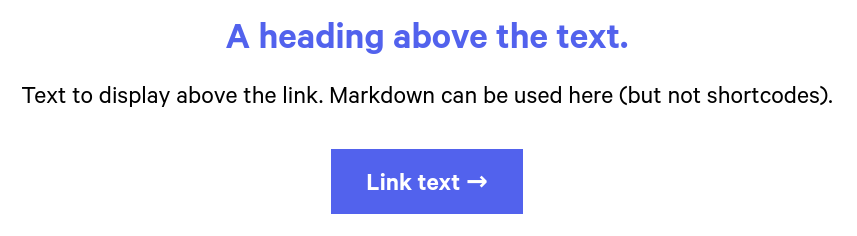
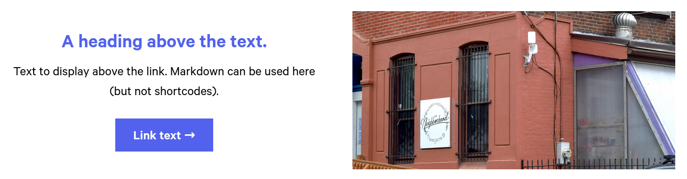
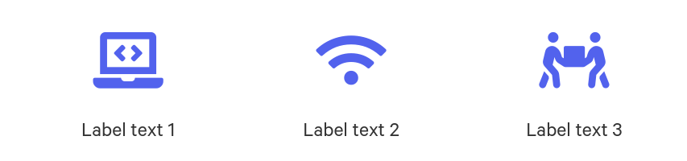

# phillycommunitywireless.org

Source code for the Philly Community Wireless website, [phillycommunitywireless.org](https://phillycommunitywireless.org) (or [pcw.fi](https://phillycommunitywireless.org)). The site is built using the [Hugo](https://gohugo.io) static site generator and hosted with [GitHub Pages](https://pages.github.com/).

**Contents**  
&nbsp;&nbsp;&nbsp;&nbsp;[Theme](#theme)  
&nbsp;&nbsp;&nbsp;&nbsp;[Local development](#local-development)
# Theme

The site's theme is a fork of [gohugo-theme-ananke](https://github.com/theNewDynamic/gohugo-theme-ananke) with major modifications.

## Custom CSS

Custom CSS lives in `/assets/pcw-hugo-theme/css/custom.css` 

## Adding Images

This site uses [Hugo's figure shortcode](https://gohugo.io/content-management/shortcodes/#figure). It's highly recommended to use `figure` rather than simple images via Markdown (i.e. ``), so that images can be automatically sized and properly styled. Non-`figure` images may not display in a consistent manner.

To insert a figure into a post, paste the following example text directly into the markdown file:

```text

```

When the site is built, it will be rendered as follows:

```html
<figure>
  
  <figcaption><h4>An elephant at sunset</h4></figcaption>
</figure>
```

We've also added an additional css class `figure-center` for centering images/captions in the viewport 

```text

```

Which will render as so:

```html
<figure class="figure-center">
  
  <figcaption><h4>An elephant at sunset</h4></figcaption>
</figure>
```

### Image Captions/Credits
You can add image captions and credits using the `figure` shortcode's parameters `caption`, `attr`, and `attrlink`. When adding captions/credits, you will most likely want to use the `figure-center` class as well to ensure the text and image are properly aligned. 

Additionally, the `caption` parameter will render any markdown in the argument - for example, `caption="*some caption here...*"` will render italicized - e.g, *some caption here*. 

*An `attr` parameter with no/an empty `attrlink` will have no link styling -  to fix this, just use '#' for the value of `attrlink` - e.g, `attrlink='#'` *

Here's an example use for a photo with attribution:

```text

```

The `figure` shortcode can use the following named parameters:

**src**

URL of the image to be displayed.

**link**

If the image needs to be hyperlinked, URL of the destination.

**target**

Optional `target` attribute for the URL if `link` parameter is set.

**rel**

Optional `rel` attribute for the URL if `link` parameter is set.

**alt**

Alternate text for the image if the image cannot be displayed.

**title**

Image title.

**caption**

Image caption. Markdown within the value of `caption` will be rendered.

**class**

`class` attribute of the HTML `figure` tag.

**height**

`height` attribute of the image.

**width**

`width` attribute of the image.

**loading**

`loading` attribute of the image.

**attr**

Image attribution text. Markdown within the value of `attr` will be rendered.

**attrlink**

If the attribution text needs to be hyperlinked, URL of the destination.

## Segments

This theme supports a `segments` front matter parameter for all normal pages, which allows for composing layouts from "stackable components". The `segments` param is a YAML list of objects, each of which will correspond to one of these components. Each type of segment uses a pre-written HTML template to render a component, like a full-width photo, a video, or a call-to-action, to the page it's used on. Segments are all full-width and can usually be customized right from the YAML.

### Example

Here is an example of some typical [Hugo front matter](https://gohugo.io/content-management/front-matter/), along with the `segments` param. This would render a single full-width image followed by a volunteering call-to-action:

```yml
---
title: Home
segments:
  - template: image
    src: images/antenna.jpg
    alt: An image of an antenna mounted on a brick wall.
  - template: call-to-action
    text: Volunteer!
    link:
      href: https://example.com/volunteer
      text: Get involved
---
```

### Segment types

A segment consists of a `template` string that determines which HTML template is used, as well as a series of other mandatory and optional params to serve as props/options for the component. These are the currently supported types:

#### `markdown`
A section of markdown text.
```yml
- template: markdown
  url: The url of the markdown file, relative to your content directory.
  # Optional
  class: CSS classes (space separated) to add to the container element. Useful for e.g. font settings, background color, etc.
```

#### `heading`
A simple full-width heading (`h1`).
```yml
- template: heading
  text: The text to display in the heading.
  # Optional
  class: Classes to add to the h1 element
```

#### `divider`
A dotted line to divide sections visually.
```yml
- template: divider
  narrow: false # Set `true` to use a narrower divider
  # Optional
  class: Classes to add to the div element
```

#### `image`
A full-width responsive image.
```yml
- template: image
  src: Image source
  alt: Alt text
  # Optional
  class: Classes to add to the img element.
```
<!--
### `gallery`
A layout of up to 6 images
```yml
- template: gallery
  images:
    - src: First image source
      alt: First image alt text
    - src: Second image source
      alt: Second image alt text
    - src: Third image source
      alt: Third image alt text
      ... Can include up to 6
  # Optional
  class: Classes to add to the container element.
```
-->
#### `video`
A full-width responsive embedded video.
```yml
- template: image
  src: Image source
  title: Title of the video (mandatory)
  # Optional
  class: Classes to add to the container element.
```

#### `call-to-action`
A highlighted section with (optionally) a header and some text, followed by a big visible link.

```yml
- template: call-to-action
  text: Text to display above the link. Markdown can be used here (but not shortcodes).
  link:
    href: The URL the link should point to.
    text: The text to display on the link.
    # Optional
    class: Classes to add to the link/button element
  # Optional
  heading: A heading above the text.
  class: Classes to add to the container element.
```



#### `call-to-action-image`
Same as above, but split vertically with an image on the right side. 
```yml
- template: call-to-action-image
  # Same as above, with the addition of:
  image:
    src: Image source
    alt: Image alt text
    # Optional 
    class: Classes to add to the img element
  # Optional
  reverse: false # Set to `true` to display the image on the left instead.
```


#### `icons`
A responsive layout featuring three font-awesome icons with optional text labels. Supports [Font Awesome 5](https://fontawesome.com/v5.0/icons) icons.
```yml
- template: icons
  icons:
    - icon: fas fa-example-1 # The Font Awesome class for your icon.
      text: Label text 1
    - icon: fas fa-example-2
      text: Label text 2
    - icon: fas fa-example-3
      text: Label text 3
  # Optional
  class: Classes to add to the container element.
```



### Adding new segment templates

You can create a new segment template by creating a `<type-name>.html` file in the `theme/pcw-hugo-theme/layouts/partials/segments` directory. This template will automatically be used to render segments with this title. The [context](https://gohugo.io/content-management/front-matter/) passed to the partial will be the segment object from the YAML (you can access the global site variable as `site`).

# Local development
## Development server
* To start the server: `docker-compose up -d`
* To stop the server: `docker-compose down`
* Server is at http://localhost:1313.
  * **NOTE - Experienced an issue on Windows where hot reloading did not work and viewing changes required restarting the container. Fixed by adding `--poll 700ms` to `server -D` in `compose` file and rebuilding container - see [Forums](https://discourse.gohugo.io/t/hugo-serve-not-detecting-changes-in-docker/38775/3)**

### Deploy a staging site for demos
* Install [hugo](https://gohugo.io/getting-started/installing/) and [surge](https://surge.sh/help/getting-started-with-surge). 
* From the project root directory, run `hugo && surge public --domain pcw-staging.surge.sh`.
* The staging site will be deployed to https://pcw-staging.surge.sh.
> Alternatively, add a file named `CNAME` with the following contents to the `/static` directory: 
> ```
> pcw-staging.surge.sh
> ```
> This will remove the need for the `--domain pcw-staging.surge.sh` option, and `hugo && surge public` will just work.
