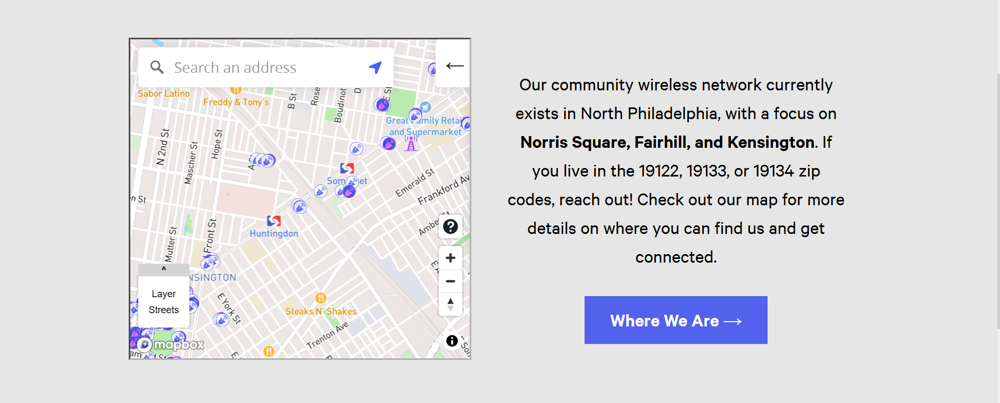
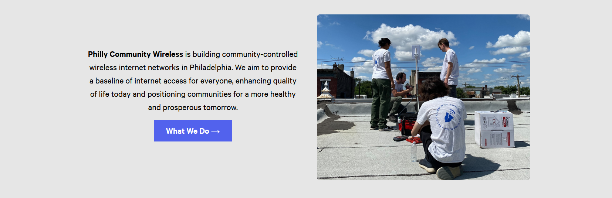
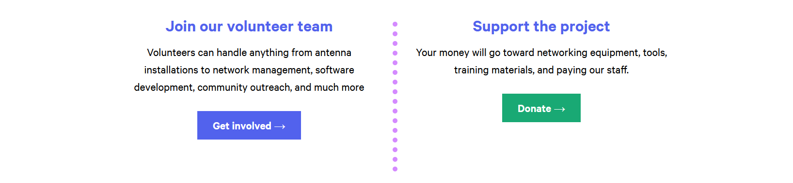
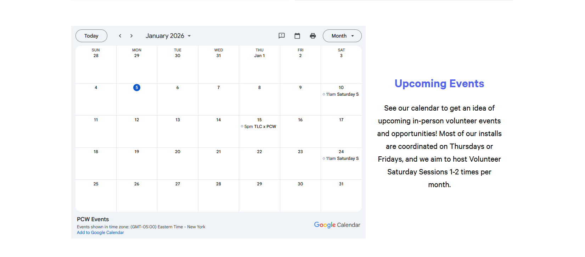
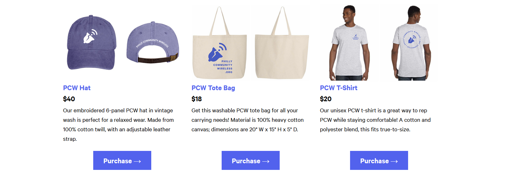

# phillycommunitywireless.org

Source code for the Philly Community Wireless website, [phillycommunitywireless.org](https://phillycommunitywireless.org) (or [pcw.fi](https://phillycommunitywireless.org)). The site is built using the [Hugo](https://gohugo.io) static site generator and hosted with [GitHub Pages](https://pages.github.com/). Deploy previews via `Render`

**Contents**  
&nbsp;&nbsp;&nbsp;&nbsp;[Theme](#theme)  
&nbsp;&nbsp;&nbsp;&nbsp;[Local development](#local-development)
# Theme

The site's theme is a fork of [gohugo-theme-ananke](https://github.com/theNewDynamic/gohugo-theme-ananke) with major modifications.

## Custom CSS

Custom CSS lives in `/assets/pcw-hugo-theme/css/custom.css` 

## Shortcodes 

### Adding Images with `figure`
This site uses [Hugo's figure shortcode](https://gohugo.io/content-management/shortcodes/#figure). It's highly recommended to use `figure` rather than simple images via Markdown (i.e. ``), so that images can be automatically sized and properly styled. Non-`figure` images may not display in a consistent manner.

To insert a `figure` into a page, paste the following example text directly into the markdown file:

```html 

```

Which will render as 
```html
<figure>
  
  <figcaption><h4>An elephant at sunset</h4></figcaption>
</figure>
```

Optionally add the `figure-center` class to center the image 

```html
<!-- from custom.css -->
.figure-center {
  display: flex;
  justify-content: center;
  /* center-align captions + photo attr credits */
  flex-direction: column;
  align-items: center;
}



<figure class="figure-center">
  
  <figcaption><h4>An elephant at sunset</h4></figcaption>
</figure>
```

You can add image captions and credits using the `figure` shortcode's parameters `caption`, `attr`, and `attrlink`. When adding captions/credits, you will most likely want to use the `figure-center` class as well to ensure the text and image are properly aligned. Additionally, the `caption` parameter will render any markdown in the argument - for example, `caption="*some caption here...*"` will render italicized - e.g, *some caption here*. 

Here's an example use for a photo with attribution:

```html

```

`figure` has several additional parameters:
* **src** - URL of the image to be displayed.
* **link** - If the image needs to be hyperlinked, URL of the destination.
* **target** - Optional `target` attribute for the URL if `link` parameter is set.
* **rel** - Optional `rel` attribute for the URL if `link` parameter is set.
* **alt** - Alternate text for the image if the image cannot be displayed.
* **title** - Image title.
* **caption** - Image caption. Markdown within the value of `caption` will be rendered.
* **class** - `class` attribute of the HTML `figure` tag.
* **height** - `height` attribute of the image.
* **width** - `width` attribute of the image.
* **loading** - `loading` attribute of the image.
* **attr** - Image attribution text. Markdown within the value of `attr` will be rendered.
  * An `attr` parameter with no/an empty `attrlink` will have no link styling -  to fix this, just use '#' for the value of `attrlink` - e.g, `attrlink='#'` *

* **attrlink** - If the attribution text needs to be hyperlinked, URL of the destination.


### Custom Buttons 
We've also created a "button-custom" shortcode for adding buttons to Markdown files. 
```html

```

Which will render to...
```html
<a role="button" href="#" class="tc dib link mv3 pa3 ph4 f3 b bg-pcw-important white">
    your text here...    
</a>
```

## Segments

This theme supports a `segments` front matter parameter for all normal pages, which allows for composing layouts from "stackable components" (partials). The `segments` param is a YAML list of objects, each of which will correspond to one of these components. Each type of segment uses a pre-written HTML template to render a component, like a full-width photo, a video, or a call-to-action, to the page it's used on. Segments are all full-width and can usually be customized right from the YAML.

### Example

Here is an example of some typical [Hugo front matter](https://gohugo.io/content-management/front-matter/), along with the `segments` param. This would render a single full-width image followed by a volunteering call-to-action:

```yml
---
title: Home
segments:
  - template: image
    src: images/antenna.jpg
    alt: An image of an antenna mounted on a brick wall.
  - template: call-to-action
    text: Volunteer!
    link:
      href: https://example.com/volunteer
      text: Get involved
---
```

### Segment types

A segment consists of a `template` string that determines which HTML template is used, as well as a series of other mandatory and optional params to serve as props/options for the component. These are the currently supported types:

#### `markdown`
A section of markdown text.
```yml
- template: markdown
  url: The url of the markdown file, relative to your content directory.
  # Optional
  class: CSS classes (space separated) to add to the container element. Useful for e.g. font settings, background color, etc.
```

#### `heading`
A simple full-width heading (`h1`).
```yml
- template: heading
  text: The text to display in the heading.
  # Optional
  class: Classes to add to the h1 element
```

#### `divider`
A dotted line to divide sections visually.
```yml
- template: divider
  narrow: false # Set `true` to use a narrower divider
  # Optional
  class: Classes to add to the div element
```

#### `image`
A full-width responsive image.
```yml
- template: image
  src: Image source
  alt: Alt text
  # Optional
  class: Classes to add to the img element.
```
<!--
### `gallery`
A layout of up to 6 images
```yml
- template: gallery
  images:
    - src: First image source
      alt: First image alt text
    - src: Second image source
      alt: Second image alt text
    - src: Third image source
      alt: Third image alt text
      ... Can include up to 6
  # Optional
  class: Classes to add to the container element.
```
-->
#### `video`
A full-width responsive embedded video.
```yml
- template: image
  src: Image source
  title: Title of the video (mandatory)
  # Optional
  class: Classes to add to the container element.
```

#### `call-to-action`
A highlighted section with (optionally) a header and some text, followed by a big visible link.

```yml
- template: call-to-action
  text: Text to display above the link. Markdown can be used here (but not shortcodes).
  link:
    href: The URL the link should point to.
    text: The text to display on the link.
    # Optional
    class: Classes to add to the link/button element
  # Optional
  heading: A heading above the text.
  class: Classes to add to the container element.
```


#### `call-to-action-image`
Same as above, but split vertically with an image on the right side. 
```yml
- template: call-to-action-image
  # Same as above, with the addition of:
  image:
    src: Image source
    alt: Image alt text
    # Optional 
    class: Classes to add to the img element
  # Optional
  reverse: false # Set to `true` to display the image on the left instead.
```


#### `icons`
A responsive layout featuring three font-awesome icons with optional text labels. Supports [Font Awesome 5](https://fontawesome.com/v5.0/icons) icons.
```yml
- template: icons
  icons:
    - icon: fas fa-example-1 # The Font Awesome class for your icon.
      text: Label text 1
    - icon: fas fa-example-2
      text: Label text 2
    - icon: fas fa-example-3
      text: Label text 3
  # Optional
  class: Classes to add to the container element.
```


#### `call-to-action-map`
A version of `call-to-action` with the Philly Commmnity Wireless webmap embedded. 
```yml
  - template: call-to-action-map
    # heading: North Philadelphia Network (Optional)
    text: Our community wireless network currently exists in North Philadelphia, with a focus on **Norris Square, Fairhill, and Kensington**. If you live in the 19122, 19133, or 19134 zip codes, reach out! Check out our map for more details on where you can find us and get connected. 
    link:
      text: Where We Are 
      href: /networkmap
      # class: (Optional) 
    class: bg-light-gray
```



#### `call-to-action-photo-right`
A version of `call-to-action` with the photo on the right by default 
```yml
  - template: call-to-action-photo-right
    text: "**Philly Community Wireless** is building community-controlled wireless internet networks in Philadelphia. We aim to provide a baseline of internet access for everyone, enhancing quality of life today and positioning communities for a more healthy and prosperous tomorrow."
    photo: "/images/web updates/clearfield-install.jpg"
    photo_alt_text: "4 PCW Volunteers on a roof, with one using a drill to secure a pole that the access point device is on."
    button: 
      button_text: "What We Do"
      button_href: "about/"
      # no_button_arrow: "true" # Toggle visibility of arrow element inside button
```



#### `call-to-action-vertical` 
A version of the call-to-action with a vertical divider 
```yaml
  - template: call-to-action-vertical
    heading1: "Join our volunteer team"
    text1: "Volunteers can handle anything from antenna installations to network management, software development, community outreach, and much more" 
    link1: 
      text: "Get involved"
      href: "volunteer/"
    heading2: "Support the project"
    text2: "Your money will go toward networking equipment, tools, training materials, and paying our staff." 
    link2: 
      text: "Donate"
      href: "#"
      class: bg-green white
```



#### `eventcalendar` 
Shows the event calendar

```yaml
  - template: eventcalendar
    heading: "Upcoming Events"
    text: "See our calendar to get an idea of upcoming in-person volunteer events and opportunities! Most of our installs are coordinated on Thursdays or Fridays, and we aim to host Volunteer Saturday Sessions 1-2 times per month."
```



#### `merch-catalog` 

shows the merch catalog 

```yaml
  - template: merch-catalog
    # title: "Currently Available"
    sections:
      - photo: "/images/merch/pcwhat.jpg"
        photo_alt_text: "A purple-blue hat with PCW's logo, a bell with a Wi-Fi signal, in front, and the words Philly Community Wireless at the back."
        item_name: PCW Hat
        item_caption: Our embroidered 6-panel PCW hat in vintage wash is perfect for a relaxed wear. Made from 100% cotton twill, with an adjustable leather strap.
        item_price: $40
        button_text: Purchase 
        button_href: "https://buy.stripe.com/5kQ3co8Jz6YD3i25zm5c409"

      # add sections as needed for the amount of items in the catalog
```



#### `newsletter-fname-lname` and `newsletter-verbose`

`newsletter-verbose` is the container element displaying the newsletter signup form, while `newsletter-fname-lname` is the actual embed from MailChimp

This was done so that the newsletter embed itself can be left in other pages - i.e, the footer. 


#### `photo-list-with-text`


#### `text-lr` 


#### `three-button-call-to-action`


### Adding new segment templates

You can create a new segment template by creating a `<type-name>.html` file in the `theme/pcw-hugo-theme/layouts/partials/segments` directory. This template will automatically be used to render segments with this title. The [context](https://gohugo.io/content-management/front-matter/) passed to the partial will be the segment object from the YAML (you can access the global site variable as `site`).

### Adding funder logos / new funders to Funders page

After navigating to `static/images`, you can add funder logos in PNG, JPG/JPEG, or SVG formats to the folder titled `funders`.

Then, you can create a new "funder card" on the Funders page (located in `content/en/funders.md` or `content/es/funders.md`) by following the format below and pasting it to the top of the `funders.md` file below the 2nd `---` divider:

(Parentheses here represent what should be replaced, for example: `(Organization Name)` -> `PCW`.)

```
<div class="funder-card">
    
    <div class="funder-desc">
        (Grant Title), <a href="(organization's website)">(Organization Name)</a>, (Year)
    </div>
</div>
```

or, if the grant has a logo/website:

```
<div class="funder-card">
    
    <div class="funder-desc">
        <a href="(grant's website)">(Grant Title)</a>, (Organization Name), (Year)
    </div>
</div>
```

### Adding partner logos / new partners to Partners page

After navigating to `static/images`, you can add partner logos in PNG, JPG/JPEG, or SVG formats to the folder titled `partners`.

Then, you can create a new "partner card" on the Partners page (located in `content/en/partners.md` or `content/es/partners.md`) by following the format below and pasting it above the line saying `<!-- insert new Norris Square Community Partner above this line -->` if you are inserting a new Norris Square Community Partner, or `<!-- insert new Philly Community Partner above this line -->` if you are inserting a new Philly Community Partner.

(Parentheses here represent what should be replaced, for example: `(Organization Name)` -> `PCW`.)

```
<div class="partner-card">
    
    <div class="partner-desc">
        <a href="(organization's website)">(Organization Name)</a>
    </div>
</div>
```

# Local development
## Docker
* Clone this repository
* Start the server with `docker-compose up -d`
* Stop the server with `docker-compose down`
* Server is at http://localhost:1313.
  * **NOTE - Experienced an issue on Windows where hot reloading did not work and viewing changes required restarting the container. Fixed by adding `--poll 700ms` to `server -D` in `compose` file and rebuilding container - see [Forums](https://discourse.gohugo.io/t/hugo-serve-not-detecting-changes-in-docker/38775/3)**

## Local Dvelopment
* Install [hugo](https://gohugo.io/getting-started/installing/) and [surge](https://surge.sh/help/getting-started-with-surge). 
* From the project root directory, run `hugo && surge public --domain pcw-staging.surge.sh`.
* The staging site will be deployed to https://pcw-staging.surge.sh.
> Alternatively, add a file named `CNAME` with the following contents to the `/static` directory: 
> ```
> pcw-staging.surge.sh
> ```
> This will remove the need for the `--domain pcw-staging.surge.sh` option, and `hugo && surge public` will just work.
