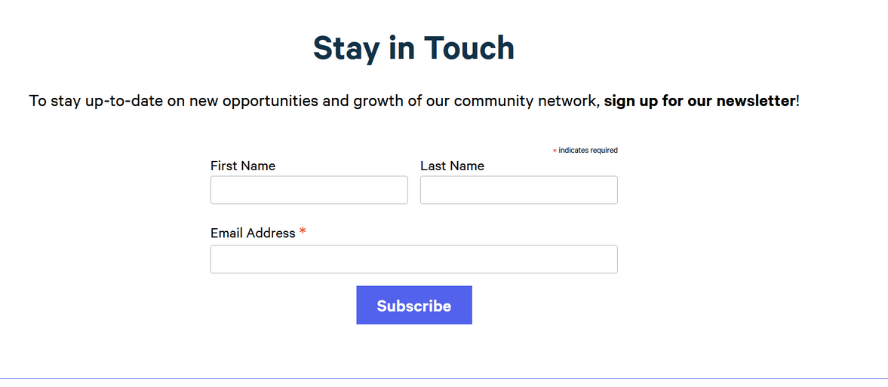
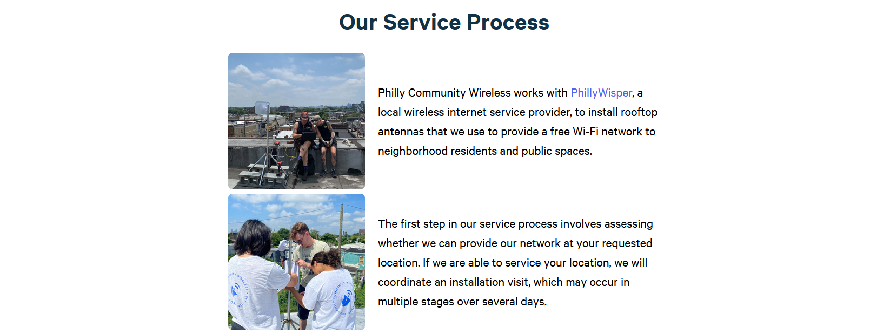
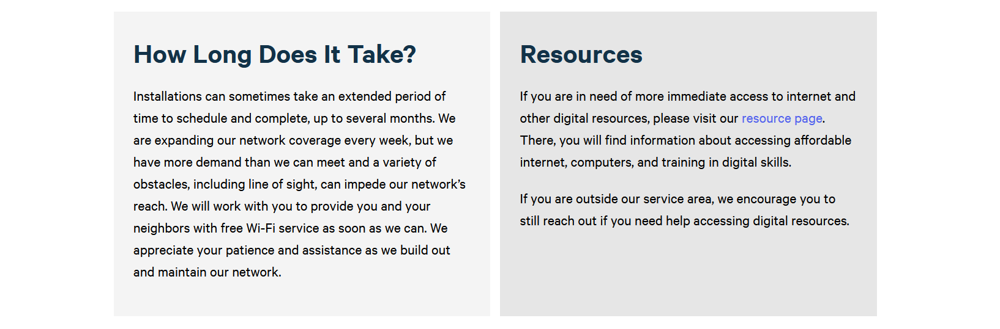
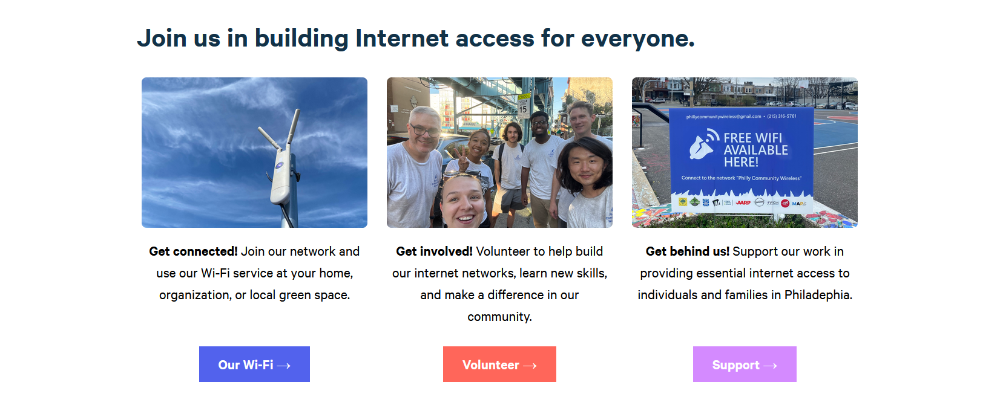

#### `markdown`
A section of markdown text.
```yml
- template: markdown
  url: The url of the markdown file, relative to your content directory.
  # Optional
  class: CSS classes (space separated) to add to the container element. Useful for e.g. font settings, background color, etc.
```

#### `heading`
A simple full-width heading (`h1`).
```yml
- template: heading
  text: The text to display in the heading.
  # Optional
  class: Classes to add to the h1 element
```

#### `divider`
A dotted line to divide sections visually.
```yml
- template: divider
  narrow: false # Set `true` to use a narrower divider
  # Optional
  class: Classes to add to the div element
```

#### `image`
A full-width responsive image.
```yml
- template: image
  src: Image source
  alt: Alt text
  # Optional
  class: Classes to add to the img element.
```
<!--
### `gallery`
A layout of up to 6 images
```yml
- template: gallery
  images:
    - src: First image source
      alt: First image alt text
    - src: Second image source
      alt: Second image alt text
    - src: Third image source
      alt: Third image alt text
      ... Can include up to 6
  # Optional
  class: Classes to add to the container element.
```
-->
#### `video`
A full-width responsive embedded video.
```yml
- template: image
  src: Image source
  title: Title of the video (mandatory)
  # Optional
  class: Classes to add to the container element.
```

#### `call-to-action`
A highlighted section with (optionally) a header and some text, followed by a big visible link.

```yml
- template: call-to-action
  text: Text to display above the link. Markdown can be used here (but not shortcodes).
  link:
    href: The URL the link should point to.
    text: The text to display on the link.
    # Optional
    class: Classes to add to the link/button element
  # Optional
  heading: A heading above the text.
  class: Classes to add to the container element.
```


#### `call-to-action-image`
Same as above, but split vertically with an image on the right side. 
```yml
- template: call-to-action-image
  # Same as above, with the addition of:
  image:
    src: Image source
    alt: Image alt text
    # Optional 
    class: Classes to add to the img element
  # Optional
  reverse: false # Set to `true` to display the image on the left instead.
```


#### `icons`
A responsive layout featuring three font-awesome icons with optional text labels. Supports [Font Awesome 5](https://fontawesome.com/v5.0/icons) icons.
```yml
- template: icons
  icons:
    - icon: fas fa-example-1 # The Font Awesome class for your icon.
      text: Label text 1
    - icon: fas fa-example-2
      text: Label text 2
    - icon: fas fa-example-3
      text: Label text 3
  # Optional
  class: Classes to add to the container element.
```


#### `call-to-action-map`
A version of `call-to-action` with the Philly Commmnity Wireless webmap embedded. 
```yml
  - template: call-to-action-map
    # heading: North Philadelphia Network (Optional)
    text: Our community wireless network currently exists in North Philadelphia, with a focus on **Norris Square, Fairhill, and Kensington**. If you live in the 19122, 19133, or 19134 zip codes, reach out! Check out our map for more details on where you can find us and get connected. 
    link:
      text: Where We Are 
      href: /networkmap
      # class: (Optional) 
    class: bg-light-gray
```


#### `call-to-action-photo-right`
A version of `call-to-action` with the photo on the right by default 
```yml
  - template: call-to-action-photo-right
    # title: "..." (Optional)
    # title_class: "..." (Optional)
    text: "**Philly Community Wireless** is building community-controlled wireless internet networks in Philadelphia. We aim to provide a baseline of internet access for everyone, enhancing quality of life today and positioning communities for a more healthy and prosperous tomorrow."
    # text_class "..." (Optional)
    photo: "/images/web updates/clearfield-install.jpg"
    photo_alt_text: "4 PCW Volunteers on a roof, with one using a drill to secure a pole that the access point device is on."
    button: 
      button_text: "What We Do"
      button_href: "about/"
      # no_button_arrow: "true" # Toggle visibility of arrow element inside button
```


#### `call-to-action-vertical` 
A version of the call-to-action with a vertical divider 
```yaml
  - template: call-to-action-vertical
    heading1: "Join our volunteer team"
    text1: "Volunteers can handle anything from antenna installations to network management, software development, community outreach, and much more" 
    link1: 
      text: "Get involved"
      href: "volunteer/"
    heading2: "Support the project"
    text2: "Your money will go toward networking equipment, tools, training materials, and paying our staff." 
    link2: 
      text: "Donate"
      href: "#"
      class: bg-green white
```


#### `eventcalendar` 
Shows the event calendar

```yaml
  - template: eventcalendar
    heading: "Upcoming Events"
    text: "See our calendar to get an idea of upcoming in-person volunteer events and opportunities! Most of our installs are coordinated on Thursdays or Fridays, and we aim to host Volunteer Saturday Sessions 1-2 times per month."
```


#### `image-catalog` 

Shows a catalog of images. Originally used to display the merch catalog, but made generic to show any image and some text. 

```yaml
  - template: image-catalog
    sections:
      - photo: "/images/merch/pcwhat.jpg"
        photo_alt_text: "A purple-blue hat with PCW's logo, a bell with a Wi-Fi signal, in front, and the words Philly Community Wireless at the back."
        heading_1: PCW Hat  
        subheading: $40 
        description_text: Our embroidered 6-panel PCW hat in vintage wash is perfect for a relaxed wear. Made from 100% cotton twill, with an adjustable leather strap.
        button_text: Purchase 
        button_href: "https://buy.stripe.com/5kQ3co8Jz6YD3i25zm5c409"


      # ...add sections as needed for the amount of items in the catalog
```


#### `newsletter-fname-lname` and `newsletter-verbose`

The newsletter signup form is separated into two partials: 
* `newsletter-verbose` - partial with section formatting, padding, etc. - serves as a container for the actual newsletter signup embed 
* `newsletter-fname-lname` - contains the actual mailing list signup form   

This was done so that the newsletter embed itself can be left in other pages without worrying about the container's styling - i.e, the footer. 

```yaml
  - template: newsletter-verbose
```
```html
  <!-- Contents of newsletter-verbose.html -->
   ...
  <div class="">
      {{ partial "segments/newsletter-fname-lname.html" . }}
  </div>
```



#### `photo-list-with-text`

A list of photos with text 

```yaml
  - template: photo-list-with-text
    title: "Our Service Process"
    images:
    - image: "/images/web updates/PW.jpg"
      alt: "Two PhillyWisper staff sitting on a roof looking at a laptop, with a structure and LiteBeam device next to them."
      text: "Philly Community Wireless works with [PhillyWisper](https://phillywisper.com), a local wireless internet service provider, to install rooftop antennas that we use to provide a free Wi-Fi network to neighborhood residents and public spaces."

    ... add the desired # of images 
```




#### `text-lr` 
Displays two columns of text 

```yaml
  - template: text-lr
    title: "some title"
    left:
      title: "How Long Does It Take?"
      text: "Installations can sometimes take an extended period of time to schedule and complete, up to several months. We are expanding our network coverage every week, but we have more demand than we can meet and a variety of obstacles, including line of sight, can impede our network's reach. 
      
      We will work with you to provide you and your neighbors with free Wi-Fi service as soon as we can. We appreciate your patience and assistance as we build out and maintain our network."
      class: tl
    
    right: 
      title: "Resources"
      text: "If you are in need of more immediate access to internet and other digital resources, please visit our [resource page](https://phillycommunitywireless.org/resources/). There, you will find information about accessing affordable internet, computers, and training in digital skills.


      If you are outside our service area, we encourage you to still reach out if you need help accessing digital resources."
      class: tl
```




#### `three-button-call-to-action`
A call to action that displays as many cards as there are inputs 

```yaml
- template: three-button-call-to-action
  title: "Join us in building Internet access for everyone."
  sections:
    - photo: "/images/IMG_6878.jpg"
      photo_alt_text: "A white access point device on a pole with the sky in the background."
      text: "**Get connected!** Join our network and use our Wi-Fi service at your home, organization, or local green space."
      button_text: Our Wi-Fi 
      button_href: "/getconnected"
    - photo: "/images/pcwvolunteers.png"
      photo_alt_text: "7 people in matching PCW t-shirts posing for a photo on a sidewalk."
      text: "**Get involved!** Volunteer to help build our internet networks, learn new skills, and make a difference in our community."
      button_text: Volunteer 
      button_href: "/volunteer"
      button_class: "bg-pcw-salmon"
    - photo: "/images/web updates/Signage_Collazo.jpg"
      photo_alt_text: "A PCW sign saying Free Wifi Available Here with PCW's contact information and logos of partner organizations."
      text: "**Get behind us!** Support our work in providing essential internet access to individuals and families in Philadephia."
      button_text: Support 
      button_href: "/support" 
      button_class: "bg-pcw-lilac"
```




#### `contact-form`
Contact form - displays an iframe with a Tally form embed. 

```yaml
  - template: contact-form
    title: "Let's chat!"
    help_text: 
      "
      If you are looking to sign up for free Wi-Fi at your home, community organization, or green space, please use our [Network Host Sign-Up Form.](https://tally.so/r/mR8VM9)


      If you are interested in volunteering with PCW, please fill in our [Volunteer Sign-Up Form](https://tally.so/r/w2ODaj).


      For other inquiries, please use the form below or leave us a voicemail at [(215)-316-5761](#). We’ll respond as soon as we can. 
      
      
      Looking forward to connecting with you!
      "
```

